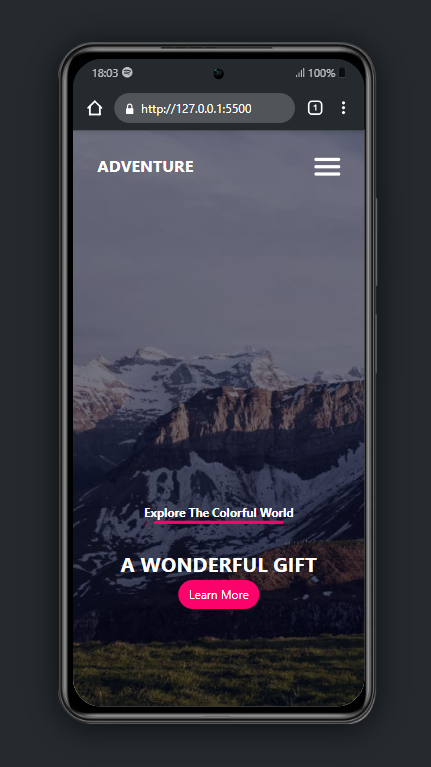
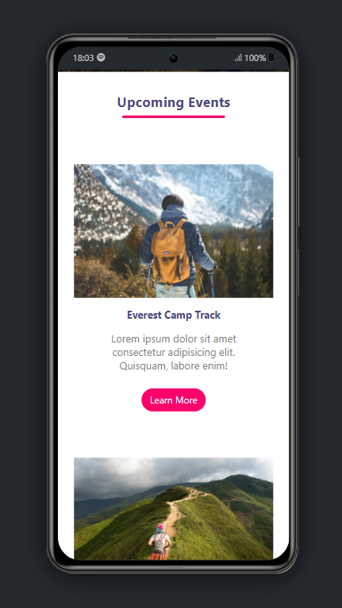
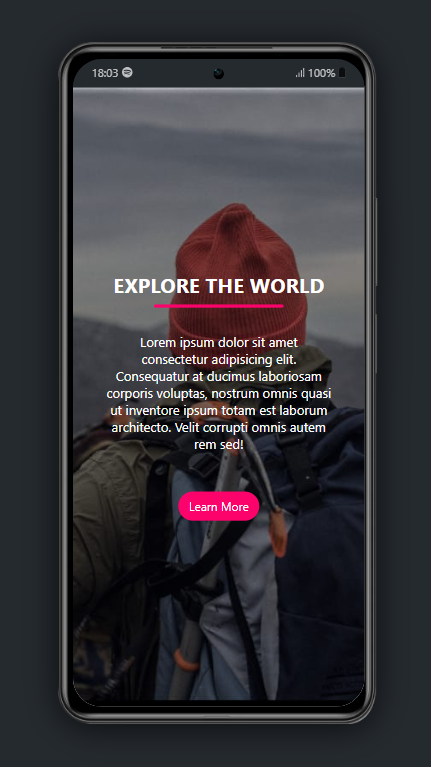
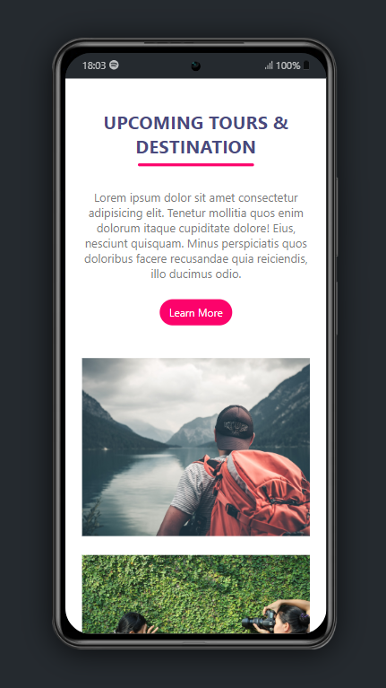
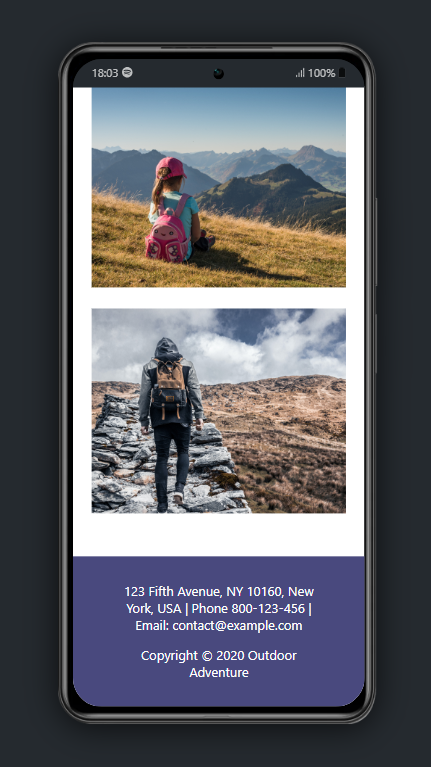

# Adventure Turism

Este é um website de Turismo desenvolvido com _HTML_, _CSS_ e um pouco de _JavaScript_ para o `mobile menu`. O site é responsivo, interativo e com um design moderno simples e elegante.

## Tecnologias

- **HTML5**
- **CSS3**
- **JavaScript ES6**

## Conhecimentos abordados

- [x] Flexbox
- [x] Transições CSS
- [x] Manipulação de DOM

## Screenshots

### Versão Mobile

